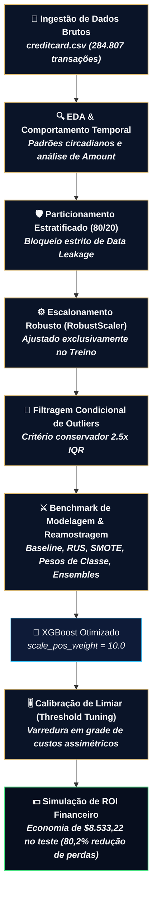

<a name="topo"></a>

<h1 align="center">🛡️ Detecção de Fraude em Cartões de Crédito: Pipeline de Machine Learning & Impacto Financeiro</h1>

<p align="center">
  <a href="https://www.python.org"></a>
  <a href="https://scikit-learn.org"></a>
  <a href="https://xgboost.readthedocs.io"></a>
  <a href="https://imbalanced-learn.org"></a>
  <a href="https://pandas.pydata.org"></a>
</p>

Este repositório apresenta um **pipeline end-to-end de Machine Learning voltado à detecção de transações fraudulentas em cartões de crédito**, com ênfase direta na governança de dados desbalanceados e na conversão de métricas estatísticas em **retorno financeiro real (ROI)**. 

O projeto endereça cenários extremos de desbalanceamento de classes (**~0,17% de eventos fraudulentos**), integrando técnicas robustas de prevenção a *data leakage*, calibração ótima de limiar decisório (*threshold tuning*) e quantificação monetária de falsos positivos e falsos negativos sob a ótica de risco bancário.

---

## 🚀 Atalhos Rápidos

* 📓 **[Notebook 01 — Análise Exploratória & Comportamento Temporal](./notebooks/01_eda.ipynb)**
* 🧪 **[Notebook 02 — Modelagem, Reamostragem, Tuning & ROI](./notebooks/02_ml_model.ipynb)**
* 💼 **[Acesse o Portfólio Oficial (DOCHMO)](https://douglas-moura-portfolio.pages.dev)**

---

## 🎯 Sumário do Projeto

- [Contexto de Negócio e Desafio](#-contexto-de-negócio-e-desafio)
- [Arquitetura do Pipeline Técnico](#-arquitetura-do-pipeline-técnico)
- [Estrutura do Repositório](#-estrutura-do-repositório)
- [Fases do Pipeline Técnico](#-fases-do-pipeline-técnico)
  - [1. Análise Exploratória e Insights de Comportamento](#1-análise-exploratória-e-insights-de-comportamento)
  - [2. Pré-processamento e Prevenção de Data Leakage](#2-pré-processamento-e-prevenção-de-data-leakage)
  - [3. Benchmark de Reamostragem e Algoritmos](#3-benchmark-de-reamostragem-e-algoritmos)
  - [4. Calibração de Limiar (Threshold Tuning)](#4-calibração-de-limiar-threshold-tuning)
  - [5. Simulação de Impacto Financeiro Real](#5-simulação-de-impacto-financeiro-real)
- [Tabela Comparativa de Performance Técnica](#-tabela-comparativa-de-performance-técnica)
- [Simulação de Impacto Financeiro (Dólares)](#-simulação-de-impacto-financeiro-dólares)
- [Tecnologias Utilizadas](#-tecnologias-utilizadas)
- [Como Reproduzir o Projeto](#-como-reproduzir-o-projeto)
- [Recomendações para Deploy e Próximos Passos](#-recomendações-para-deploy-e-próximos-passos)
- [Autor](#-autor)

---

## 💼 Contexto de Negócio e Desafio

No setor financeiro e de pagamentos, os sistemas de prevenção a fraude operam sob o constante dilema de dois custos assimétricos e conflitantes:

1. **Falso Negativo (FN — Fraude não detectada):** A instituição bancária ou o emissor do cartão arca com a perda financeira integral do valor transacionado (`Amount`), somado a encargos de estorno (*chargeback*) e desgaste de conformidade regulatória.
2. **Falso Positivo (FP — Alarme falso):** Uma transação legítima é indevidamente bloqueada ou enviada para esteira de análise humana. Isso incorre em custo operacional direto de atendimento/SMS (estimado em ~$15 por caso) e provoca atrito severo com clientes de alto valor.

Em uma base transacional contendo **0,172% de fraudes (492 ocorrências em 284.807 transações)**:

> ⚠️ **A Acurácia é uma Métrica Enganosa:**  
> Um classificador trivial que atribua classe legítima a todas as transações atinge **99,83% de acurácia**, mas permite o vazamento de 100% das fraudes, colapsando a segurança do ecossistema.
>
> 🎯 **Foco da Otimização:**  
> Maximizar o **Recall** (captura volumétrica das fraudes) mantendo uma **Precisão** sustentável para controlar custos de averiguação, utilizando como norte analítico a área sob a curva Precision-Recall (**PR-AUC**).

---

## 📐 Arquitetura do Pipeline Técnico

O fluxo de dados foi desenhado para assegurar isolamento amostral rigoroso, reprodutibilidade e tomada de decisão orientada a custo:



---

## 📂 Estrutura do Repositório

O projeto segue padrões de engenharia de software modular, desacoplando o código de produção em módulos reutilizáveis dentro de `src/` e reservando os notebooks para exploração visual e demonstração:

```text
credit_card_fraud_detection/
├── data/
│   └── creditcard.csv                 # Base transacional (Kaggle/ULB - 284.807 registros)
├── notebooks/
│   ├── 01_eda.ipynb                   # Análise exploratória profunda, comportamento temporal e outliers
│   └── 02_ml_model.ipynb              # Pipelines de ML, reamostragem, tuning e simulação de ROI
├── src/
│   ├── __init__.py                    # Módulo Python estruturado
│   ├── preprocessing.py              # RobustScaler e split estratificado anti-leakage
│   ├── outlier_detector.py           # Análise e corte conservador de ruídos via IQR no treino
│   ├── modeling.py                   # Treinamento de pipelines (RUS, SMOTE, Class-Weights, XGBoost)
│   ├── metrics.py                    # Curvas PR-AUC, ROC-AUC e matrizes de confusão
│   └── business.py                   # Otimização financeira de limiares (Threshold Tuning) e ROI
├── requirements.txt                   # Dependências do ecossistema Python
└── README.md                          # Documentação executiva e técnica do projeto
```

---

## 🚀 Fases do Pipeline Técnico

### 1. Análise Exploratória e Insights de Comportamento
* **Janelas Temporais Circadianas (`Time`):** Enquanto transações legítimas sofrem retração acentuada na madrugada (período de repouso) e atingem pico comercial entre 9h e 21h, as fraudes mantêm **alta densidade proporcional na madrugada**, momento em que a percepção das vítimas e as notificações em tempo real demoram mais a ser notadas.
* **Comportamento Financeiro (`Amount`):** Mais de **75% das fraudes transacionam valores inferiores a $105,00**, apresentando mediana de apenas **$9,25**. O padrão é característico de ataques automatizados de *card testing* (testes de validade com quantias irrisórias para não disparar travas preventivas de limite de crédito).
* **Componentes Principais (`V1` a `V28`):** As variáveis PCA latentes `V14`, `V12`, `V10` e `V17` exibiram forte correlação inversa com o evento de fraude, ao passo que `V11`, `V4` e `V2` demonstraram forte correlação direta.

### 2. Pré-processamento e Prevenção de Data Leakage
* **Escalonamento Robusto:** Emprego de `RobustScaler` nas variáveis `Time` e `Amount` com base na mediana e no Intervalo Interquartil (IQR), neutralizando a influência de transações com valores extremos sem introduzir distorções paramétricas.
* **Particionamento Estratificado (80/20):** Separação de Treino e Teste antes de qualquer operação de transformação ou reamostragem, preservando a razão original de 0,172% em ambos os splits e impedindo vazamento de informação (*data leakage*).
* **Filtragem Condicional de Outliers:** Variáveis como `V14` concentram fraudes exatamente em suas caudas extremas; um descarte cego removeria justamente os padrões fraudulentos raros. Implementou-se um corte condicional conservador ($2.5 \times \text{IQR}$), preservando mais de **98,5% das fraudes** do conjunto de treino.

### 3. Benchmark de Reamostragem e Algoritmos
Avaliamos estratégias representativas de tratamento de desbalanceamento avaliadas no **conjunto de teste intocado**:
1. *Regressão Logística Baseline*: Elevada precisão (82,9%), porém baixo recall (64,3%), deixando escapar 35 fraudes.
2. *Under-sampling Aleatório (RUS)*: Atinge 91,8% de recall, contudo destrói a precisão (3,8%) ao gerar 2.270 alarmes falsos.
3. *Over-sampling Sintético (SMOTE)*: Mantém 91,8% de recall, mas introduz 1.467 falsos positivos (precisão de 5,8%).
4. *Pesos de Classe Inversos (`balanced`)*: Recall de 91,8% com 1.406 alarmes falsos.
5. *Ensembles de Árvores (Random Forest & XGBoost)*: Apresentaram dominância completa, segregando fronteiras de decisão complexas com superioridade em PR-AUC e F1-Score.

### 4. Calibração de Limiar (Threshold Tuning)
Modelos convencionais assumem ponto de corte em $p = 0,50$. Pelo módulo `src.business`, mapeou-se uma grade de 100 limiares entre $0,01$ e $0,99$, parametrizando a curva da função de custo total para descobrir o ponto operacional ótimo.

### 5. Simulação de Impacto Financeiro Real
* **Custo do Falso Negativo (FN):** Prejuízo equivalente a 100% do montante transacionado (`Amount`).
* **Custo do Falso Positivo (FP):** Custo de triagem humana/contato operacional estipulado em **$15,00**.
* **Resultado:** Cálculo explícito da economia gerada frente ao cenário passivo sem modelo (*Status Quo*) e ao modelo linear de referência.

---

## 📊 Tabela Comparativa de Performance Técnica

Resultados consolidados apurados no **conjunto de teste intocado** (56.962 transações, contendo 98 fraudes reais):

| Modelo | Estratégia de Balanceamento | Recall | Precision | F1-Score | PR-AUC | ROC-AUC | Falsos Negativos (Fraudes Perdidas) | Falsos Positivos (Alarmes Falsos) |
| :--- | :--- | :---: | :---: | :---: | :---: | :---: | :---: | :---: |
| **🏆 XGBoost Otimizado** | **Cost-Sensitive (`scale_pos_weight=10.0`)** | **85,71%** | **86,60%** | **86,15%** | **0,8681** | **0,9741** | **14** | **13** |
| Random Forest | Class-Weighted Subsample | 81,63% | 79,21% | 80,40% | 0,8088 | 0,9731 | 18 | 21 |
| Logistic Regression | Baseline (Sem Balanceamento) | 64,29% | 82,89% | 72,41% | 0,7409 | 0,9573 | 35 | 13 |
| Logistic Regression | SMOTE (Over-sampling) | 91,84% | 5,78% | 10,88% | 0,7233 | 0,9715 | 8 | 1.467 |
| Logistic Regression | Class-Weighted (`balanced`) | 91,84% | 6,02% | 11,29% | 0,7189 | 0,9721 | 8 | 1.406 |
| Logistic Regression | Under-sampling (RUS) | 91,84% | 3,81% | 7,32% | 0,6940 | 0,9760 | 8 | 2.270 |

---

## 💵 Simulação de Impacto Financeiro (Dólares)

Simulação executada na partição de teste sobre um volume total de **$10.644,93 em tentativas de fraude**:

| Cenário de Decisão | Fraudes Prevenidas ($) | Fraudes Não Detectadas - FN ($) | Custo Operacional - FP ($) | Custo Total Operacional ($) | Economia Líquida Gerada ($) |
| :--- | :---: | :---: | :---: | :---: | :---: |
| **1. Sem Modelo Antifraude (Status Quo)** | $0,00 | $10.644,93 | $0,00 | **$10.644,93** | $0,00 |
| **2. Baseline (Regressão Logística @ 0.50)** | $4.506,29 | $6.138,64 | $195,00 (13 FPs) | **$6.333,64** | **$4.311,29** |
| **3. XGBoost Otimizado (@ Limiar 0.50)** | $8.508,66 | $2.136,27 | $165,00 (11 FPs) | **$2.301,27** | **$8.343,66** |
| **4. XGBoost Otimizado (@ Limiar Ótimo 0.35)** | **$8.713,22** | **$1.931,71** | **$180,00 (12 FPs)** | **$2.111,71** | **$8.533,22** |

> 🏆 **Conclusão de Negócio:**  
> A sintonia do limiar decisório no XGBoost (`threshold = 0,35`) garantiu a interceptação de **81,9% do volume monetário total de fraudes**, alcançando uma **economia líquida de $8.533,22** apenas no recorte de teste e reduzindo as perdas operacionais em **80,2%** em relação ao cenário sem inteligência preditiva.

---

## 🛠️ Tecnologias Utilizadas

* **Linguagem & Ambiente:** Python 3.12+, Jupyter Lab
* **Engenharia de Dados & Manipulação:** `pandas`, `numpy`
* **Machine Learning & Otimização:** `scikit-learn`, `xgboost`, `imbalanced-learn`
* **Visualização Analítica:** `matplotlib`, `seaborn`

---

## 💻 Como Reproduzir o Projeto

### Pré-requisitos
Certifique-se de possuir o Python 3.10+ instalado em seu ambiente local.

### 1. Clonar e Acessar o Diretório
```bash
git clone https://github.com/douglascmoura/credit_card_fraud_detection.git
cd credit_card_fraud_detection
```

### 2. Configurar o Ambiente Virtual
* **No Windows (PowerShell):**
  ```powershell
  python -m venv venv
  .\venv\Scripts\Activate.ps1
  ```
* **No Linux / macOS:**
  ```bash
  python3 -m venv venv
  source venv/bin/activate
  ```

### 3. Instalar as Dependências
```bash
pip install -r requirements.txt
```

### 4. Obter a Base de Dados
Certifique-se de que o arquivo `creditcard.csv` esteja alocado no diretório `data/` (`credit_card_fraud_detection/data/creditcard.csv`). O dataset pode ser obtido no [Kaggle](https://www.kaggle.com/datasets/mlg-ulb/creditcardfraud).

### 5. Executar os Notebooks
Inicie o ambiente interativo:
```bash
jupyter lab
```
Execute os notebooks em ordem cronológica:
1. `notebooks/01_eda.ipynb` — Diagnóstico exploratório e estudo temporal.
2. `notebooks/02_ml_model.ipynb` — Pipeline de pré-processamento, benchmark, calibração de corte e ROI.

---

## ✍🏽 Autor

<table align="center">
  <tr>
    <td align="center" width="150px">
      <br />
      <sub><b>Douglas Chaves Moura</b></sub>
    </td>
    <td>
      <p>Estatístico, pesquisador e cientista de dados idealizador da marca <b>DOCHMO</b>. Atuando no desenvolvimento de soluções de <b>Machine Learning, Detecção de Fraudes Financeiras, Análise de Risco, Inteligência Artificial</b> e <b>Estatística Aplicada de Alta Performance</b>.</p>
      <p align="left">
        <a href="https://github.com/douglascmoura"></a>
        <a href="https://www.linkedin.com/in/douglas-chaves-moura/"></a>
        <a href="mailto:douglascmoura21@gmail.com"></a>
        <a href="https://douglas-moura-portfolio.pages.dev/"></a>
      </p>
    </td>
  </tr>
</table>

<p align="right"><a href="#topo">🔼 Voltar ao topo</a></p>
